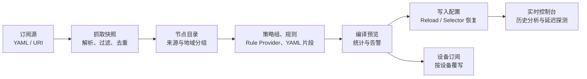
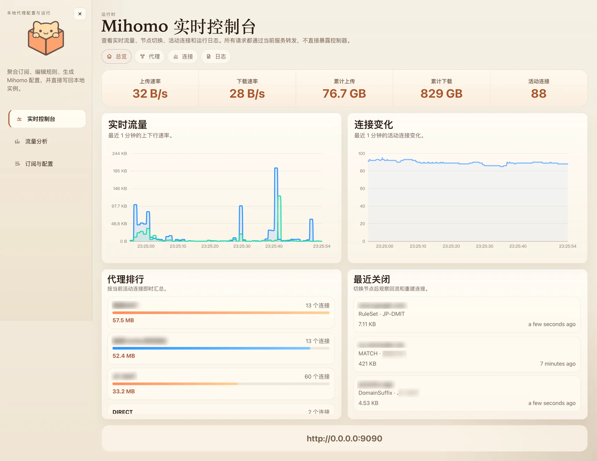
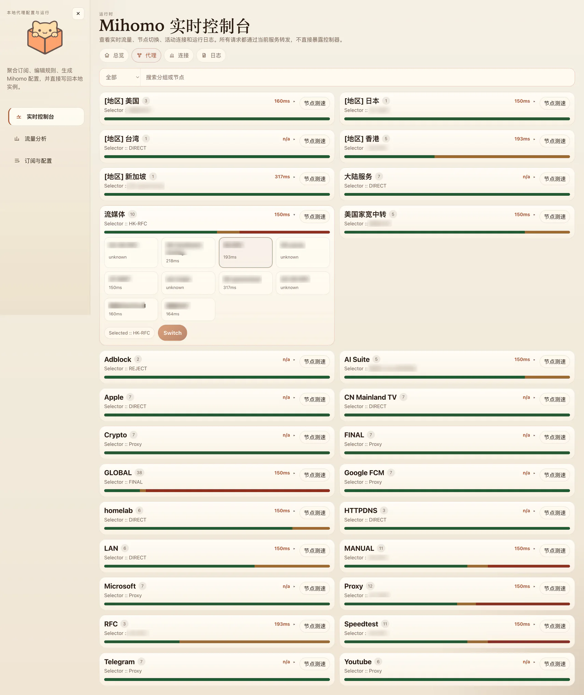
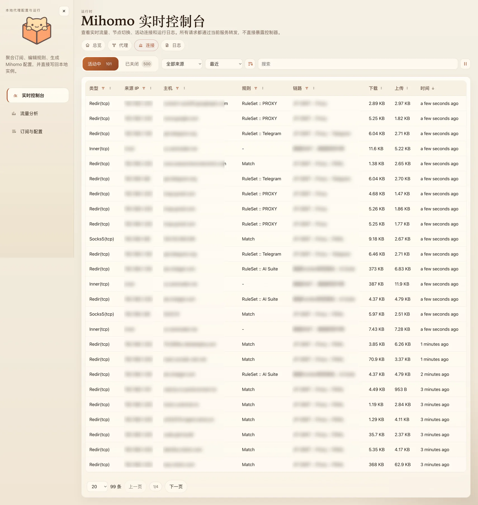
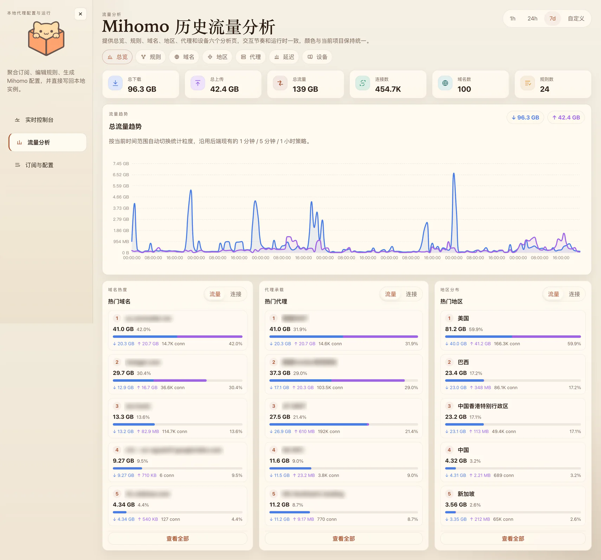
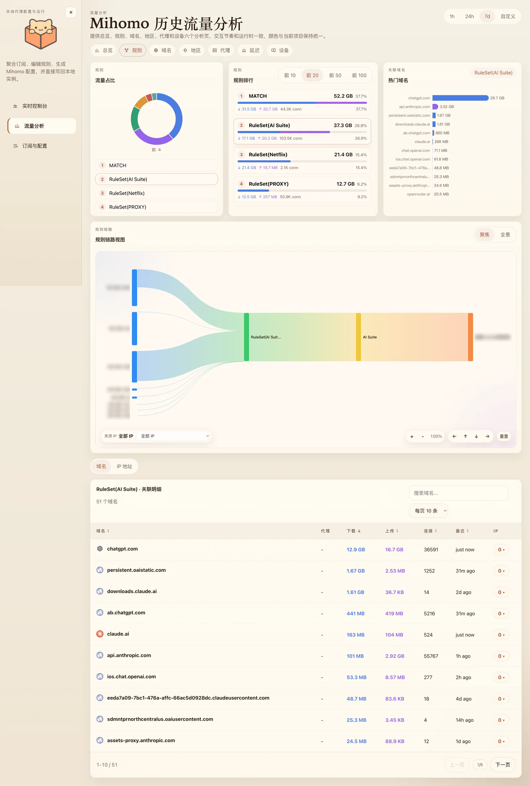
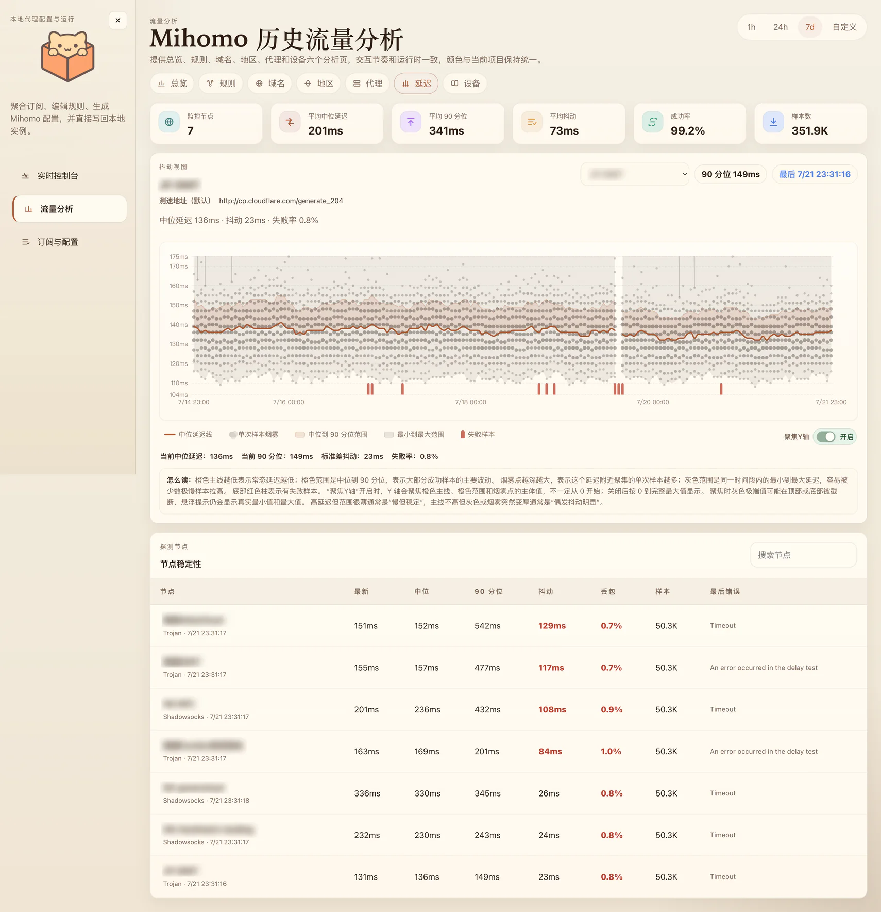
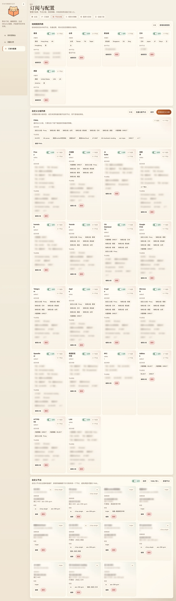
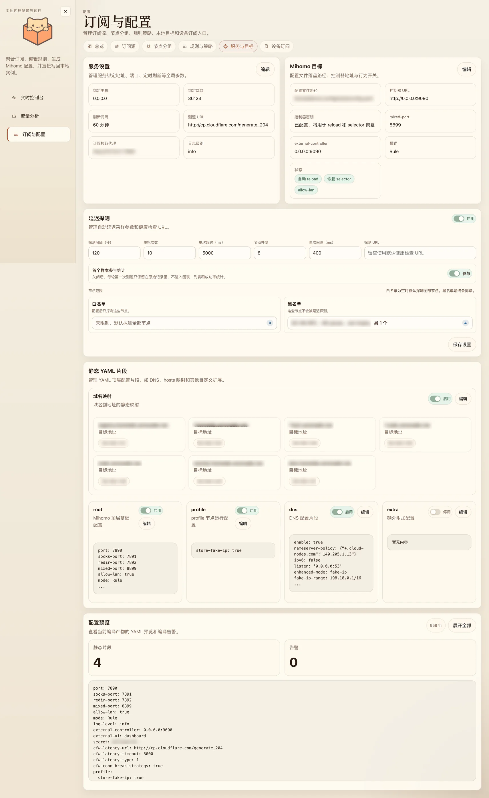
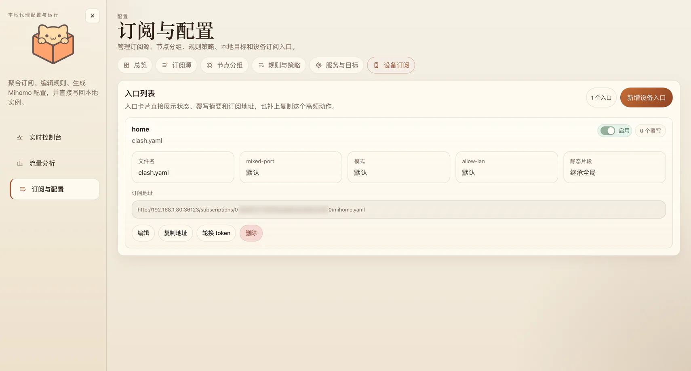

# NekoCube

> A neko-powered control cube for Mihomo.

NekoCube 是一个自托管的代理配置与运行管理服务。它从多个订阅源收集节点，在 Web 界面中管理分组、规则和设备配置，最终生成可供 Clash/Mihomo 使用的 YAML。

名称 **NekoCube** 融合了 [MetaCubeXD](https://github.com/MetaCubeX/metacubexd) 与 [Neko Master](https://github.com/foru17/neko-master)：`Cube` 表达统一承载配置、规则与运行状态的控制面，`Neko` 则延续轻巧、友好的产品气质。名称仅用于说明灵感来源；NekoCube 是独立的第三方项目，与上述项目以及 Clash、Mihomo 及其维护团队没有隶属或官方合作关系。

项目适合运行在个人电脑、家庭服务器或受信任的内网中。管理 API 没有登录鉴权，不应直接暴露到公网。

## 工作流程

NekoCube 把订阅抓取、节点整理、规则编排、配置发布和运行观测串成一条完整链路：



## 功能详情

### 订阅聚合与自动刷新

- 管理多个订阅源的地址、启停状态、顺序和节点名称前缀策略。
- 解析 Clash/Mihomo YAML，以及明文或 Base64 编码的 Hysteria2、VLESS URI 列表。
- 自动过滤流量提示、到期提醒和无效占位节点，并保存每次抓取的状态、时间、节点数量和错误信息。
- 支持为订阅抓取配置 HTTP 代理；可单独刷新某个源，也可按全局周期自动执行“刷新、编译、应用”。

### 节点整理与策略组

- 按节点指纹去重，处理同名节点，并可按订阅源名称自动添加前缀。
- 使用关键词把节点归入香港、台湾、新加坡、日本、美国等地域；地域和关键词都可以自行增删、排序和停用。
- 自动生成来源分组、地域分组、`MANUAL` 和 `FINAL`，并实时预览最终展开后的节点。
- 创建 `select`、`url-test`、`fallback` 自定义策略组，成员可来自单个节点、订阅分组、地域分组、其他策略组或 `DIRECT`、`REJECT` 等内置策略。
- 支持批量分配成员、调整分组与成员顺序，并检查循环引用和失效成员。
- 可视化维护自定义节点，也可以从 YAML 批量导入；中转节点可引用 `dialer-proxy`。

### 规则、Rule Provider 与 YAML 片段

- 管理 `DOMAIN`、`DOMAIN-SUFFIX`、`DOMAIN-KEYWORD`、`IP-CIDR`、`SRC-IP-CIDR`、端口、进程、`GEOIP`、`MATCH` 和原始规则等类型。
- 为规则选择任意策略组或内置策略，配置 `no-resolve`、启停状态和匹配顺序。
- 以结构化表单或原始 YAML 管理 Rule Provider，支持 `classical`、`domain`、`ipcidr` 行为以及 YAML、文本格式。
- 支持规则集批量导入、批量编辑和排序；编译时会校验策略目标，并对失效引用给出告警。
- 通过 `root`、`profile`、`dns`、`hosts`、`extra` 静态片段补充 Mihomo 顶层配置，无需修改生成器代码。

### 配置编译、发布与迁移

- 在写入前预览完整 YAML、节点数、策略组数、规则数和编译告警。
- 将最新产物和最后一次成功产物分别留档，再写入页面配置的 Mihomo 目标路径。
- 可通过 Controller Secret 调用 Mihomo reload，并在重载前后保存、恢复 Selector 选择。
- 本地开发模式使用隔离数据目录和安全应用模式，避免误操作真实 Controller。
- 整包导出、导入订阅源、规则、规则集、分组、静态片段、设备和服务目标设置，便于迁移与备份。

### 设备订阅

- 为每台设备创建独立、可轮换 Token 的 Mihomo/Clash YAML 订阅地址。
- 每个入口可以覆盖文件名、`mixed-port`、`allow-lan`、`external-controller`、Secret 和运行模式。
- `root`、`profile`、`dns`、`hosts`、`extra` 可按设备选择继承、停用或自定义，节点、分组和规则仍与全局配置共享。
- 编辑设备时可实时预览最终配置；停用或删除入口后，对应订阅地址立即失效。

### 实时控制台

- 浏览器不直接请求 Mihomo Controller API；连接和控制操作由 NekoCube 后端转发，Secret 只在后端目标配置中使用。
- 查看实时上下行速率、累计流量、活动连接、最近关闭连接和代理承载排行。
- 搜索策略组或节点、查看延迟与可用性、对单组执行测速，并直接切换 Selector。
- 在活动与已关闭连接之间切换，按来源、主机、规则、链路或流量筛选、排序、分组和暂停刷新。
- 搜索、排序、分组、暂停或清空实时日志，并动态调整 Mihomo 日志级别。

### 历史流量与节点质量

- 按 `1h`、`24h`、`7d` 或自定义时间范围查看趋势和汇总数据。
- 从规则、域名、目标 IP、地区、代理和设备维度分析下载、上传、连接数和最近活动时间。
- 支持维度间下钻，查看规则链路、关联域名、关联 IP 和代理承载关系。
- 基于 GeoIP 展示全球流量地图；MMDB 支持自动下载、定时更新，也可回退到在线查询。
- 历史数据默认保存在 SQLite，可选接入 ClickHouse，并配置查询源和分钟/小时数据保留周期。
- 定时或手动探测节点延迟，统计 P50、P90、P95、抖动、成功率和丢包率，并以 SmokePing 风格图表查看波动。

## 界面预览

以下截图来自实际运行实例，敏感字段已在截图中处理。长图保留完整页面，便于查看各模块的功能结构和信息密度。

### 实时控制

#### 运行状态

集中查看实时上下行速率、累计流量、活动连接、短周期趋势和当前代理排行。



#### 节点与策略组

展开区域或业务策略组，查看节点延迟、当前出口，并直接完成测速和节点切换。



#### 活动连接

在活动和已关闭连接之间切换，按来源、主机、规则、链路、流量或时间筛选和排序。



### 流量分析

#### 历史流量总览

按时间范围查看流量趋势、热门域名、代理排行和地区分布，并进入不同维度继续分析。



#### 规则与链路

比较规则流量、连接数量和热门域名，并通过链路视图查看规则、域名与代理之间的关系。



#### 节点延迟与稳定性

通过 SmokePing 风格图表和节点明细查看延迟分布、抖动、成功率和长期稳定性。



### 订阅与配置

#### 节点分组

维护地域匹配规则、自定义策略组和自定义节点，并预览每个分组实际展开的节点。



#### 服务与目标

配置服务参数、Mihomo 写出与重载目标、节点探测，以及编译时使用的静态 YAML 片段。



#### 设备订阅

为不同设备维护独立订阅入口、文件名和覆盖参数，并支持复制地址或轮换 Token。



## 环境要求

- Node.js `20.18.1` 或更高版本
- npm
- macOS、Linux，或 Windows 上的 WSL
- Mihomo 仅在需要连接真实 controller 时才需要安装

## 本地启动

安装依赖：

```bash
npm ci
```

分别启动后端和前端：

```bash
npm run dev:local
```

```bash
npm run dev:web:local
```

打开 <http://127.0.0.1:4000>。首次启动会进入初始化向导，可以添加订阅源、确认配置写出位置并生成第一份配置。

`dev:local` 是日常开发推荐模式：

- 数据写入 `data/dev/`，不会使用生产数据。
- 定时任务关闭。
- “生成并应用”仍会拉取订阅并写入 `data/dev/clash/config.yaml`，但不会读取 selector、调用 controller reload 或恢复 selector。

## 联调本地 Mihomo

仓库提供了一套可选的本地联调环境。把 Mihomo 可执行文件放到 `.dev/mihomo/mihomo`，或者通过 `MIHOMO_BIN` 指定位置，然后在三个终端中运行：

```bash
npm run dev:mihomo
```

```bash
npm run dev:clash
```

```bash
npm run dev:web:local
```

检查 controller 是否可访问：

```bash
npm run dev:mihomo:check
```

默认联调地址如下：

| 服务 | 地址 |
| --- | --- |
| Web | `http://127.0.0.1:4000` |
| 后端 | `http://127.0.0.1:36124` |
| Mihomo controller | `http://127.0.0.1:9096` |
| Mihomo mixed port | `17890` |

如需 controller secret，应让 Mihomo 进程和后端使用同一个值：

```bash
export MIHOMO_SECRET="change-me"
export DEV_MIHOMO_SECRET="$MIHOMO_SECRET"
```

本地 Mihomo 的运行文件位于 `.dev/mihomo/`，不会进入版本控制。

## 构建和运行

```bash
npm run build
npm start
```

生产模式默认监听 `127.0.0.1:36123`，数据保存在 `data/default/`。前端由同一个 Fastify 进程从 `dist/public/` 提供。

生产模式会启用调度器，“生成并应用”也会按页面中的目标设置执行真实写入和可选 reload。首次运行前应先检查“订阅与配置 -> 本地目标”。

### 自动应用的部署要求

如果希望 NekoCube 在生成配置后自动写入文件并让配置生效，应将 NekoCube 与 Mihomo 部署在同一台机器上。页面中的 `configPath` 是 NekoCube 进程所在主机的本地文件路径；NekoCube 会先写入该路径，再调用 Mihomo controller 执行 reload。

仅把 `controllerUrl` 配置为远程 Mihomo 地址并不能把配置文件传输到另一台机器。如果 NekoCube 与 Mihomo 分开部署，仍可使用配置预览和设备订阅功能，但需要由 Mihomo 客户端拉取订阅，或通过额外的文件同步与部署流程让远程配置生效。

应用设置保存在 SQLite 中。修改代码中的默认值不会覆盖已有数据库；升级后请在页面中确认监听地址、目标路径和 controller 选项。

## 配置

应用不自动读取 `.env` 文件。请通过 shell、systemd、容器编排工具或其他进程管理器注入环境变量。

### 运行模式

| 变量 | 默认值 | 作用 |
| --- | --- | --- |
| `LOCAL_DEV_MODE` | 未设置 | 设为 `1` 时使用 `data/dev/`、关闭调度器并启用安全应用模式 |
| `DEV_MIHOMO_MODE` | 未设置 | 设为 `1` 时使用本地 Mihomo 联调目标，同时启用本地开发模式 |
| `LOCAL_DEV_MIHOMO` | 未设置 | `DEV_MIHOMO_MODE` 的兼容别名 |
| `DEV_MIHOMO_SECRET` | 空 | 后端连接本地联调 controller 时使用的 secret |
| `VITE_API_TARGET` | 按运行模式推导 | Vite 开发服务器代理到的后端地址 |

### 浏览器访问

| 变量 | 默认值 | 作用 |
| --- | --- | --- |
| `NEKOCUBE_CORS_ORIGINS` | 未设置 | 允许访问 API 的跨域 origin，多个值用逗号分隔 |

CORS 默认关闭。同源部署不需要设置这个变量。虽然支持 `*`，但管理 API 没有鉴权，不建议使用通配符。旧变量 `CLASH_CONFIG_CORS_ORIGINS` 仍作为兼容别名使用，新配置应改用 `NEKOCUBE_CORS_ORIGINS`。

后端监听地址和端口不是环境变量，保存在应用设置中。新数据库默认使用 `127.0.0.1:36123`；需要远程访问时，应先配置可信的反向代理、VPN 或 SSH tunnel，再修改监听地址。

### GeoIP

| 变量 | 默认值 | 作用 |
| --- | --- | --- |
| `GEOIP_MMDB_PATH` | `geoip/GeoLite2-Country.mmdb` | 指定 MMDB 文件 |
| `GEOIP_MMDB_DIR` | `geoip` | 指定自动管理 MMDB 的目录 |
| `GEOIP_MMDB_DISABLED` | `0` | 设为 `1` 时禁用本地 MMDB 查询 |
| `GEOIP_MMDB_AUTO_UPDATE` | `1` | 设为 `0` 时禁止启动和定时下载 MMDB |
| `GEOIP_MMDB_DOWNLOAD_URL` | 内置 jsDelivr 地址 | 覆盖 MMDB 下载地址，响应应为 gzip |
| `GEOIP_MMDB_REFRESH_CRON` | `23 4 * * 1` | MMDB 刷新计划 |
| `GEOIP_LOOKUP_PROVIDER` | 自动回退在线查询 | 设为 `local` 时不调用在线 GeoIP API |
| `GEOIP_ONLINE_API_URL` | 内置在线服务地址 | 覆盖在线 GeoIP 查询接口 |

如需完全禁止 GeoIP 相关的外部请求，同时设置：

```bash
export GEOIP_MMDB_AUTO_UPDATE=0
export GEOIP_LOOKUP_PROVIDER=local
```

### ClickHouse

设置 `CLICKHOUSE_URL` 后可启用 ClickHouse 分析存储。可选变量包括 `CLICKHOUSE_DATABASE`、`CLICKHOUSE_USER`、`CLICKHOUSE_PASSWORD` 和 `ANALYTICS_QUERY_SOURCE_DEFAULT`；未配置 ClickHouse 时使用本地 SQLite。

### 本地 Mihomo 脚本

`scripts/run-dev-mihomo.sh` 支持 `MIHOMO_BIN`、`MIHOMO_HOME`、`MIHOMO_CONFIG`、`MIHOMO_CONTROLLER`、`MIHOMO_SECRET`、`MIHOMO_MIXED_PORT`、`MIHOMO_SOCKS_PORT` 和 `MIHOMO_DNS_LISTEN`。`scripts/check-dev-mihomo.sh` 另支持 `MIHOMO_CONTROLLER_URL`。

## 数据和备份

运行数据默认位于：

```text
data/<namespace>/
├── app.db
├── clash/config.yaml
└── compiled/
    ├── latest.yaml
    └── last-success.yaml
```

`data/`、`.dev/`、`dist/` 和 `geoip/*.mmdb` 都不应提交。

Web 页面中的“导出配置包”会导出订阅 URL、controller secret 和设备 token。配置包适合迁移业务配置，但不包含任务记录和订阅快照；请按敏感文件保存。直接备份 `data/` 可以保留完整运行状态，恢复前应停止服务。

## 安全说明

- 管理 API 没有登录、授权或 CSRF 防护，只适合本机或受信任网络。
- 设备订阅 URL 中的 token 等同于访问凭证，泄露后应在页面中轮换。
- SQLite 数据库和导出的配置包都可能以明文保存 secret、token 和订阅 URL。
- 服务会根据配置访问订阅源、rule provider、Mihomo controller、GeoIP 服务和 ClickHouse。

漏洞报告和部署建议见 [SECURITY.md](SECURITY.md)。

## 开发与验证

```bash
npm run lint
npm test
npm run build
```

依赖变更还应运行：

```bash
npm audit --omit=dev --audit-level=moderate
```

`npm run typecheck` 当前仍会报告既有的前端类型问题，因此 CI 暂时将它设为非阻断项。新改动不应增加类型错误。

贡献代码前请阅读 [CONTRIBUTING.md](CONTRIBUTING.md)。

## 许可证

除第三方依赖和数据文件适用各自许可证外，NekoCube 使用 [MIT License](LICENSE) 开源。
